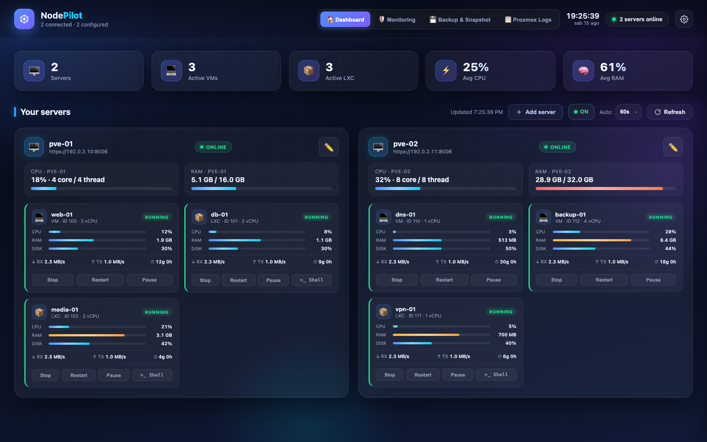
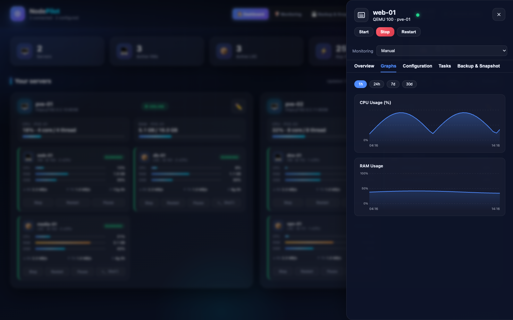
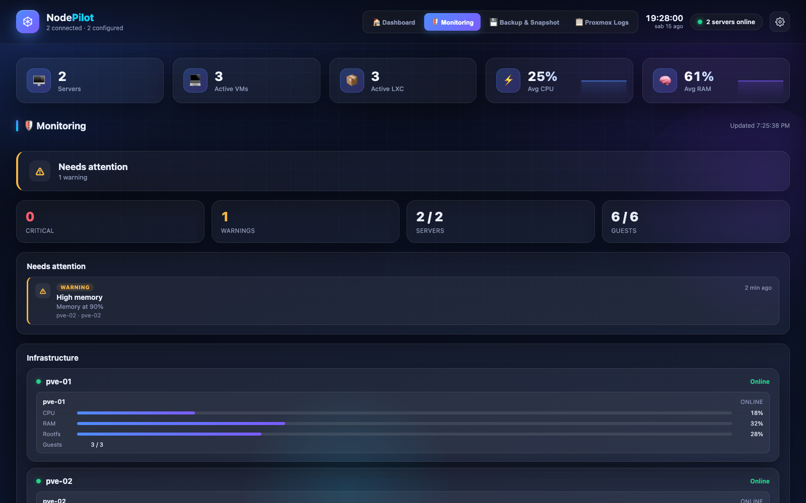
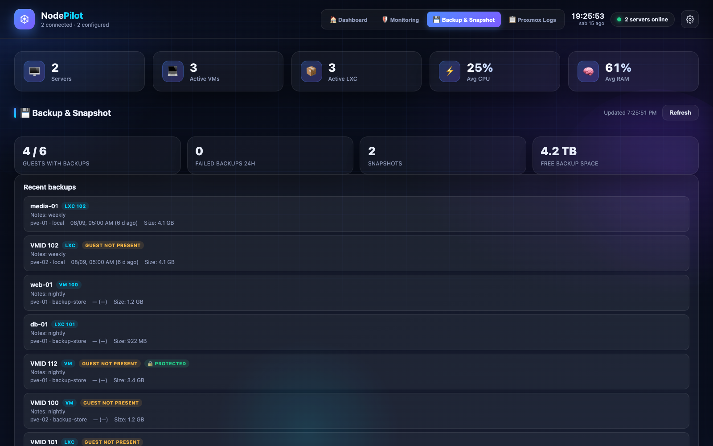
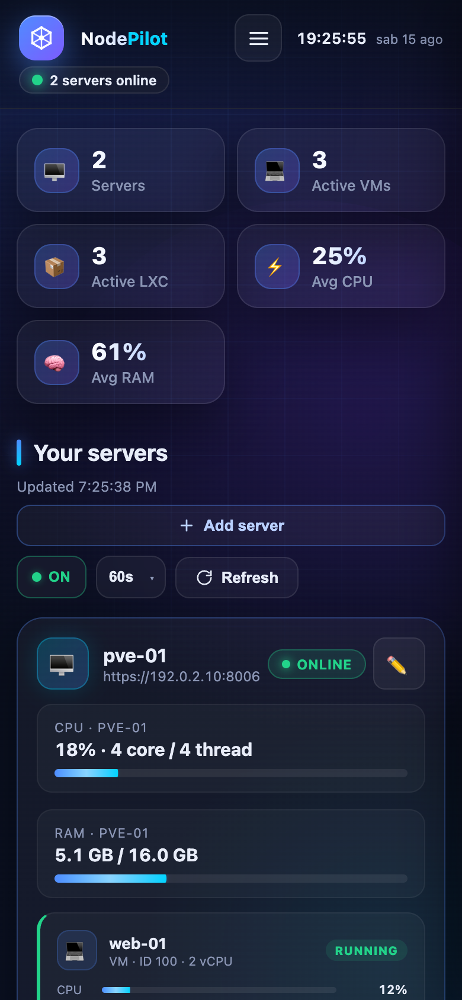

# NodePilot

**Self-hosted Proxmox Infrastructure Dashboard**

[](https://github.com/Alexmen97/nodepilot/actions/workflows/ci.yml)
[](LICENSE)
[](https://github.com/Alexmen97/nodepilot/releases)



A lightweight, dependency-minimal web dashboard to manage and monitor one or
more **Proxmox VE** servers (VMs and LXC containers) directly from the browser.

- **Backend**: Node.js (>= 22, Node 24 LTS recommended), framework-free, single runtime dependency (`ws`)
- **Frontend**: vanilla JavaScript/HTML/CSS — no bundler, no framework
- **Data**: live from the Proxmox API (`/api2/json`) — always real data, no demo mode
- **PWA**: installable, versioned cache, voluntary updates

## Installation

### Recommended: clone and install

```bash
git clone https://github.com/Alexmen97/nodepilot.git
cd nodepilot
./install.sh
```

### Quick: download and install

```bash
curl -fsSL https://raw.githubusercontent.com/Alexmen97/nodepilot/main/install.sh | bash
```

To choose a different directory with the quick method, append it:

```bash
curl -fsSL https://raw.githubusercontent.com/Alexmen97/nodepilot/main/install.sh | bash -s -- /path/to/nodepilot
```

`install.sh` is idempotent and non-destructive:

- checks the OS (Linux/macOS) and the requirements (bash, git, Node.js >= 22, npm); it never installs system packages by itself and prints distribution-specific hints instead;
- installs dependencies with `npm ci --omit=dev` (no global installs);
- creates `config.json` (from `config.example.json`) and `state.json` if missing, with mode 600;
- starts the interactive dashboard password setup when `auth.json` is not configured — the password is never shown in the terminal;
- never overwrites an existing `config.json`, `auth.json` or `state.json`: re-running it is safe.

Start NodePilot with:

```bash
npm start
```

Open <http://localhost:3100> and log in with the credentials set during
installation. The server listens on port `3100` by default; override it
with the `PORT` environment variable.

### Manual installation (without the installer)

```bash
npm ci
npm run auth:set-password
npm start
```

On first login of a new user an optional introduction with the guided tour is
offered; the tour can be skipped or restarted any time from
**Settings → Restart tour** and always runs on real data.

## Features

- **Multi-server dashboard** — server status, global statistics and per-node VM/LXC cards
- **Guest actions** — start / stop / restart / suspend / resume, with confirmation
- **Guest Detail panel** — overview, CPU/RAM RRD charts (1h / 24h / 7d / 30d), configuration, last 25 tasks, Backup & Snapshot tab
- **Proxmox logs** — tasks, system log and cluster log, with filters and per-task detail
- **LXC Shell** — in-browser terminal via xterm.js (termproxy/vncwebsocket), for privileged and unprivileged containers
- **Health Center** — healthy/warning/critical status, thresholds, expected state and task alerts
- **Backup & Snapshot Manager V1** — backups, snapshots, storages and scheduled jobs, with guided creation and UPID tracking (read + create)
- **Local authentication** — username/password login, HttpOnly session cookie, rate limiting, protected API and Shell WebSocket
- **Change password** — update the dashboard password from Settings; all sessions are invalidated and a new sign-in is required
- **Guided tour V2** — 15 steps over real data, no automatic demo
- **Theme** light/dark/system, **Italian/English UI**, responsive mobile/desktop layout

## Screenshots

| Guest Detail | Health Center |
| --- | --- |
|  |  |

| Backup & Snapshot | Mobile |
| --- | --- |
|  |  |

## Demo

Watch a quick walkthrough of the main views — dashboard, Guest Detail,
Health Center, Backup & Snapshot and the mobile layout:

[NodePilot demo video](https://github.com/user-attachments/assets/6fd8e0ee-2d25-421c-be90-92e64d5e1c9f)


## Requirements

- Node.js >= 22 with npm (Node 24 LTS recommended)
- one or more Proxmox VE servers reachable from the machine running NodePilot

## Proxmox configuration

Add servers from **Settings → Servers** (name, URL, user, password,
verifyTls), or create `config.json` from `config.example.json`:

```json
{
  "refreshMs": 10000,
  "autoRefreshEnabled": true,
  "theme": "system",
  "language": "it",
  "servers": [
    {
      "id": "pve-main",
      "name": "Main Proxmox",
      "url": "https://192.0.2.10:8006",
      "user": "root@pam",
      "password": "YOUR_PASSWORD",
      "verifyTls": false
    }
  ],
  "health": {
    "guestModes": {
      "pve-main:nodo1:qemu:100": "alwayson"
    }
  }
}
```

- `verifyTls: false` is normally required with Proxmox self-signed certificates.
- Nodes are discovered automatically from the API: there is no `node` field.
- `refreshMs` is the dashboard polling interval (5–60 seconds, also settable
  from the UI).
- Optional `health.guestModes` maps `<serverId>:<node>:<type>:<vmid>`
  (`qemu` or `lxc`) to `alwayson` or `ignore` for Health Center
  expected states; `manual` is the default.

## Security

- Dashboard password stored as an scrypt hash in `auth.json` — never in
  plain text, never tracked by Git.
- Session cookie `hl_session`: HttpOnly, SameSite=Lax, 12 h idle timeout,
  7 day absolute lifetime; sessions are in-memory (a backend restart requires
  a new login).
- Login rate limit: 5 failed attempts per 15 minutes per IP.
- Changing the password from Settings invalidates all sessions and returns
  the browser to the login screen.
- Security headers on every response (CSP, X-Frame-Options, nosniff,
  Referrer-Policy) and Origin validation on authenticated mutating requests
  and the Shell WebSocket.
- Passwords, hashes, cookies and session ids are never logged.

Operators: expose NodePilot only on a trusted local network or behind a
reverse proxy with HTTPS, and keep `config.json`, `auth.json` and
`state.json` readable only by the service user. See
[SECURITY.md](SECURITY.md).

## Runtime files

| File | Content | Git | Permissions |
| --- | --- | --- | --- |
| `config.json` | Proxmox servers (credentials) and preferences | ignored | 600 |
| `auth.json` | dashboard username + scrypt password hash | ignored | 600 |
| `state.json` | persistent state (e.g. tour completed) | ignored | 600 |

These files are created locally at runtime and are never committed.

## Updating

```bash
git pull
npm ci
# restart the NodePilot process
```

Restarting the backend invalidates active sessions: log in again after the
update.

## Run NodePilot as a service

`scripts/install-service.sh` installs NodePilot as an automatic service with
three subcommands: `install`, `uninstall` and `status`.

### Linux (systemd)

```bash
sudo ./scripts/install-service.sh install
sudo ./scripts/install-service.sh status
sudo systemctl restart nodepilot
sudo journalctl -u nodepilot -f
sudo ./scripts/install-service.sh uninstall
```

- Runs as a dedicated system user `nodepilot` (never root).
- Ownership is changed only for `config.json`, `auth.json` and
  `state.json` (mode 600); the source code and `.git` keep their original
  owner.
- If the installation directory is not accessible to the service user (for
  example a clone under a private home directory), the script stops with
  clear instructions instead of changing permissions; `/opt/nodepilot` is the
  suggested location.
- Customize the port at install time with `PORT=...`, or later with
  `sudo systemctl edit nodepilot`.

### macOS (LaunchAgent)

```bash
./scripts/install-service.sh install
./scripts/install-service.sh status
launchctl kickstart -k gui/$(id -u)/io.github.alexmen97.nodepilot
tail -f ~/Library/Logs/NodePilot/stdout.log
./scripts/install-service.sh uninstall
```

- Runs as the current user, without sudo, and starts automatically at login.
- Logs are written to `~/Library/Logs/NodePilot/`.
- Customize the port at install time with `PORT=...`.

Restarting the service invalidates active sessions (sessions are in-memory).


## Troubleshooting

- **"Autenticazione non configurata"**: run `npm run auth:set-password` and
  restart the backend.
- **404 on endpoints after editing `server.js`**: the backend must be
  restarted to serve the new routes.
- **Theme not applied**: the CSP in `server.js` pins a hash of the single
  inline theme script; if that script changes, update the hash (see
  [docs/ARCHITECTURE.md](docs/ARCHITECTURE.md)).
- **Proxmox connection errors with self-signed certificates**: set
  `verifyTls: false` for that server.
- **Login blocked with 429**: login rate limit — wait up to 15 minutes.
- **Empty LXC Shell**: `xterm.css` must be served from
  `public/vendor/xterm.css`; after asset updates check the PWA cache version.
- **Wrong credentials format**: the Proxmox user must include the realm
  (e.g. `root@pam`).

## Troubleshooting Linux

NodePilot is verified on **Debian and Ubuntu**; other recent Linux
distributions work as well.

- **Node.js >= 22 is required** (Node 24 LTS recommended): the installer stops
  with clear instructions when Node.js or npm is missing or too old.
- **Default port: TCP 3100**. Override it with the `PORT` environment variable.
- **Firewall (optional, LAN only)**: the example below restricts TCP 3100 to a
  private subnet for UFW users; adapt it to your own LAN and firewall:

  ```bash
  sudo ufw allow from 192.168.1.0/24 to any port 3100 proto tcp
  ```

  This step is optional, may need `sudo`, and is not run by the installer.
- **`install.sh` never uses sudo and never installs system packages by
  itself**: install Node.js and git with the package manager of your
  distribution first, then run the installer.

**Security note: do not expose port 3100 directly to the Internet. Use a VPN
or reverse proxy with HTTPS for remote access.**

## Project structure

```text
nodepilot
├── install.sh              # idempotent installer (Linux/macOS)
├── server.js               # Node backend: API, auth, Proxmox client, WebSocket Shell
├── package.json            # start and auth:set-password scripts
├── config.example.json     # template for the local config.json
├── scripts/set-password.js # dashboard password setup
├── docs/ARCHITECTURE.md    # architecture overview for contributors
└── public/
    ├── index.html          # DOM structure, layout and modals
    ├── app.js              # frontend logic: polling, rendering, Guest Detail, shell
    ├── style.css           # theme and responsive layout
    ├── i18n.js             # IT/EN translations
    ├── manifest.json       # PWA
    ├── sw.js               # service worker (versioned cache)
    ├── icons/              # app icons
    └── vendor/             # xterm.js and addons (LXC shell only)
```

## Documentation

- [docs/ARCHITECTURE.md](docs/ARCHITECTURE.md) — architecture and verified
  behavior
- [CHANGELOG.md](CHANGELOG.md) — release notes (Italian)
- [ROADMAP.md](ROADMAP.md) — project status and direction (Italian)

## Contributing and security

- [CONTRIBUTING.md](CONTRIBUTING.md)
- [SECURITY.md](SECURITY.md)
- [THIRD_PARTY_NOTICES.md](THIRD_PARTY_NOTICES.md)

## License

[MIT](LICENSE) · Copyright (c) 2026 Alexmen97
